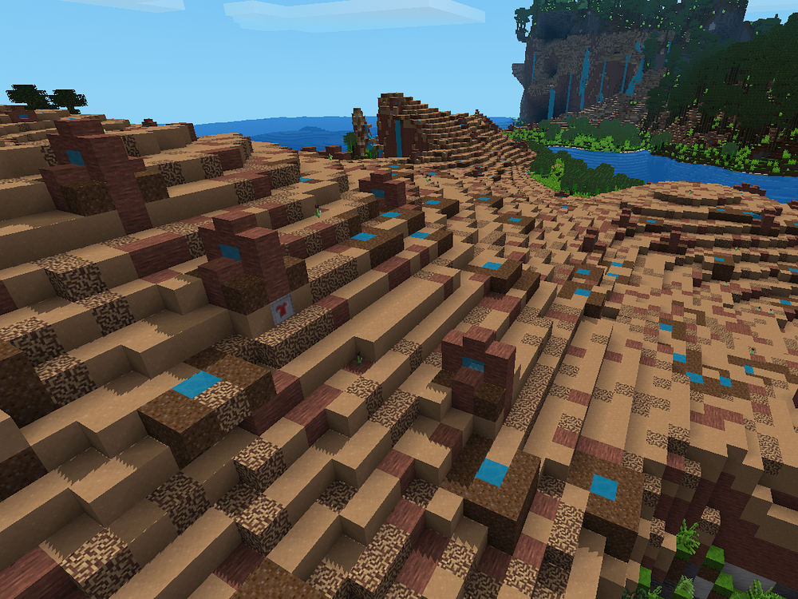

# danger_biomes
 ## Danger Biomes
----------

This luanti/minetest mod adds 4 dangerous biomes.

Using blocks from the minetest_game, the ethereal-, mosecons- & moremesecons- mods, 
this mod adds 4 biomes with deadly dangers.

+ Icepoke 
	a cold-wet biome made of snow & ice covered with quicksand-traps, the large ones lead to lava-pools.
 
 
+ Sweatplane 
	a hot-wet biome made of dry-dirt, coral & water-puddles covered with drowning-traps, 
	which teleport you into water-filled enclosures if you come to near.
	Because of the dry-dirt turning to "normal"-dirt near the water-puddles, 
	this biome can be slowly "taken over" by neighbouring biomes, making it more difficult to spot the danger.
 

+ Lavaflood 
	a hot-dry biome, just lava flowing over quicksand. Deadly.
 

+ Blastlands 
	a cold-dry biome made of permafrost, coal & baked clay, filled with explosive traps.
	Naturally spawning black candles lure in players at night with friendly light, but 
	day & night this biome is an explosive danger. 
 	
	TNT coupled with a player-detector is burried everywhere.
 
 
-----------
 
-----------
 
License: Code: MIT
Mod dependencies: default, flowers, stairs, fire, tnt, ethereal, mesecons, mesecons_detector, moremesecons_teleporter

Author: DeadLock